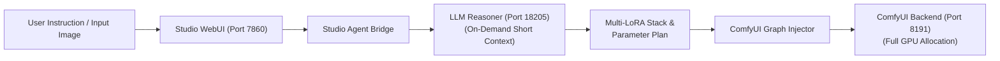

# Image Agent Studio — Studio Agent Specification

The **Studio Agent** is an autonomous vision-language reasoning and workflow orchestration engine. It bridges natural language instructions and reference images with ComfyUI diffusion pipelines, autonomously composing optimal multi-LoRA stacks, tuning generation parameters, enforcing 3D spatial coherence, and orchestrating GPU VRAM handovers.

---

## 🏗️ Architecture & Service Topology



### Strict VRAM Handover Protocol
1. **On-Demand LLM Invocation**: The LLM planner loads into VRAM with a lightweight context window (`-c 4096`).
2. **5-Second Reasoning Cycle**: The agent inspects the prompt and input image, composes the multi-LoRA stack, tunes sampling parameters, and generates the English diffusion instruction.
3. **Immediate Memory Release**: The LLM process unloads from VRAM, freeing 100% of GPU resources before ComfyUI begins UNet diffusion.

---

## 🎛️ Autonomous Multi-LoRA Dispatch Matrix

The Studio Agent dynamically selects from the following verified LoRA models based on visual attributes and user intent:

### 🌟 Qwen-Image 2.1 LoRA Catalog

| LoRA Model | Recommended Weight | Purpose & Trigger Condition |
|---|---|---|
| `NSFW Qwen Lora.safetensors` | `0.65` | **Flagship Intimacy**: Rank 32 comprehensive model by f23gg. Delivers physiological accuracy, natural mucosal textures, and coherent pelvic alignment in a single model. |
| `NSFW_Qwen_TheseAlpacas_V2.safetensors` | `0.55 ~ 0.80` | **Benchmark Anatomy**: Foundational structural detail, hands, and anatomy enhancer. |
| `qwen21_vagina_v1.safetensors` | `0.65 ~ 0.70` | **Anatomical Co-Pilot**: Specialized female mucosal structures and anti-smoothing protection. |
| `RealStockings_QWEN.safetensors` | `0.65 ~ 0.70` | **Stockings & Fabric**: Mandated whenever black stockings, pantyhose, garter belts, or translucent leg fabric appear or are requested. |
| `nicegirls_qwen12.safetensors` | `0.50 ~ 0.55` | **Aesthetic & Cosplay Realism**: Mandated for photorealistic cosplay style transfers, delicate youthful facial features, porcelain skin translucency, and studio lighting. |
| `VNCCS_QI2_PoseStudioV1.1.safetensors` | `0.50 ~ 0.70` | **Pose & 3D Angle Control**: Mandated whenever altering body posture, complex dynamic gestures, or camera angles. |
| `Qwen2.1_Anime_consistency.safetensors` | `0.60 ~ 0.80` | **Anime Style Consistency**: Preserves pure 2D cel-shading and manga styling when photorealism is not requested. |
| `Q21 make the penis small.safetensors` | `0.50 ~ 0.70` | **Male Anatomy Refinement**: Proportional scaling and anatomical correction for male anatomy. |

### 🌸 Anima AIO Yuri LoRA Stack

| LoRA Model | Recommended Weight | Role |
|---|---|---|
| `Scenery_enchancer-Anima-P3.safetensors` | `0.50` | Scenery depth and environmental illumination |
| `bakaE79AAEE882A4.Md2S.safetensors` | `0.45` | RealSkin texture and micro-details |
| `Anima-写实光.safetensors` | `0.65 ~ 1.0` | Atmospheric darklight and cinematic contrast |
| `anima_context_detailer_base10.safetensors` | `0.50` | Composition, hands, and anatomical detailing |
| `anima-highres-aesthetic-boost.safetensors` | `0.50` | Line art sharpness and aesthetic enhancement |
| `Anima_colorfix_v1_by_Volnovik.safetensors` | `0.30` | Color correction and tone stabilization |

---

## 🧩 Multi-LoRA Synergy Recipes (Decision Tree)

When multiple concepts overlap, the agent stacks compatible LoRAs:

1. **Recipe A: Cosplay Photography + Stockings + Anatomy (3-LoRA Gold Stack)**
   - LoRAs: `NSFW Qwen Lora` (0.65) + `RealStockings_QWEN` (0.65) + `nicegirls_qwen12` (0.50)
   - Parameters: `cfg`: 2.8, `steps`: 40, `sampler`: `er_sde`, `scheduler`: `beta`
2. **Recipe B: Cosplay Photography + Stockings (Non-Intimate)**
   - LoRAs: `nicegirls_qwen12` (0.60) + `RealStockings_QWEN` (0.70)
   - Parameters: `cfg`: 2.0, `steps`: 35, `sampler`: `er_sde`, `scheduler`: `beta`
3. **Recipe C: Anime Style + Anatomy**
   - LoRAs: `NSFW Qwen Lora` (0.65) + `Qwen2.1_Anime_consistency` (0.65)
   - Parameters: `cfg`: 2.8, `steps`: 40, `sampler`: `er_sde`, `scheduler`: `beta`
4. **Recipe D: Dynamic Pose Alteration + Anatomy**
   - LoRAs: `NSFW Qwen Lora` (0.65) + `VNCCS_QI2_PoseStudioV1.1` (0.60)
   - Parameters: `cfg`: 2.8, `steps`: 40, `sampler`: `er_sde`, `scheduler`: `beta`
5. **Recipe E: Native Qwen Edits (Color, Clothing, Background)**
   - LoRAs: `[]` (None)
   - Parameters: `cfg`: 1.0, `steps`: 40, `negative_prompt`: `""`

---

## 📐 Dynamic 3D Spatial & Posture Alignment Protocol

When rendering asymmetrical or tilted poses:
1. **Asymmetrical Posture Anchor**: If the subject lifts one leg, leans laterally, or twists the torso, the agent explicitly anchors the diagonal angle in the prompt:
   - State that the pelvic axis is tilted diagonally following the angle of the raised limb.
   - Align all central anatomical structures along this diagonal axis rather than assuming vertical symmetry.
2. **Anti-Smoothing Directive**: Prevent the base DiT model from smoothing over textures into flat skin:
   - Prohibit ambiguous conditional terms (`if exposed`, `if visible`, `whether or not`).
   - Use declarative descriptions of texture, depth, and anatomical contours.
3. **Negative Token Guard**: Inject anti-smoothing negative tokens:
   - `smooth crotch, featureless crotch, barbie doll crotch, flat crotch, missing genitalia, erased genitalia, blurry crotch, twisted anatomy, sideways genitals, inverted anatomy, lowres`.

---

## 🌐 Language Cross-Attention Rules

- **User Interaction**: Bilingual (Chinese / English).
- **Diffusion Prompt Generation**: The final `rewritten_prompt` sent to ComfyUI **MUST ALWAYS BE IN ENGLISH**. Community LoRAs are trained on English captions; English prompts activate cross-attention weights with maximum fidelity and eliminate language-tokenization artifacts.

---

## 📋 JSON Output Schema for Workflows

```json
{
  "rewritten_prompt": "Continuous descriptive English paragraph...",
  "wh_ratio": "2:3",
  "ratio_follow": "",
  "steps": 40,
  "cfg": 2.8,
  "seed": -1,
  "loras": [
    {"name": "NSFW Qwen Lora.safetensors", "strength": 0.65},
    {"name": "RealStockings_QWEN.safetensors", "strength": 0.65},
    {"name": "nicegirls_qwen12.safetensors", "strength": 0.50}
  ],
  "negative_prompt": "smooth crotch, featureless crotch, barbie doll crotch, flat crotch, blurry, deformed, lowres"
}
```
